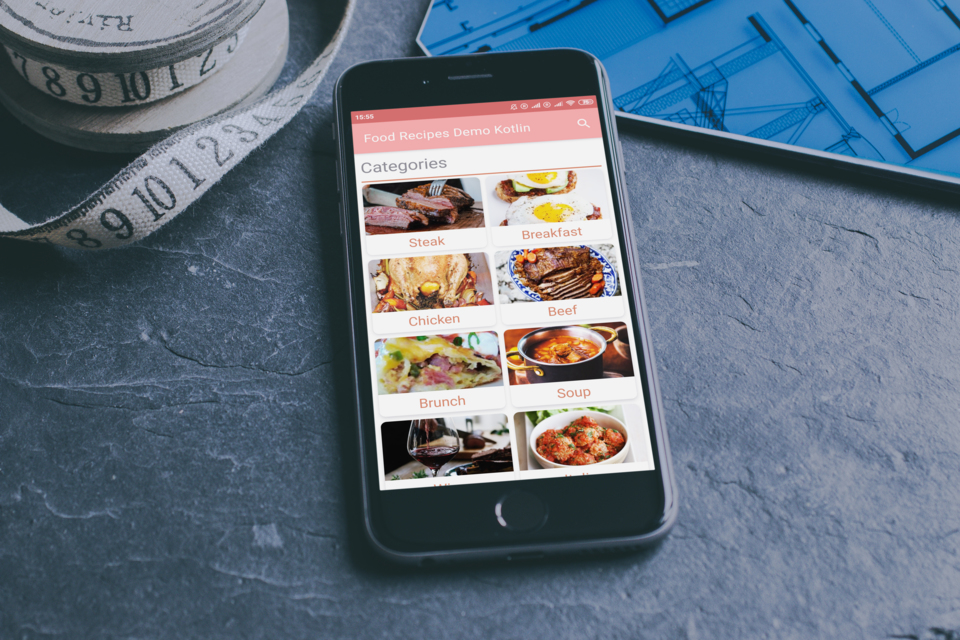
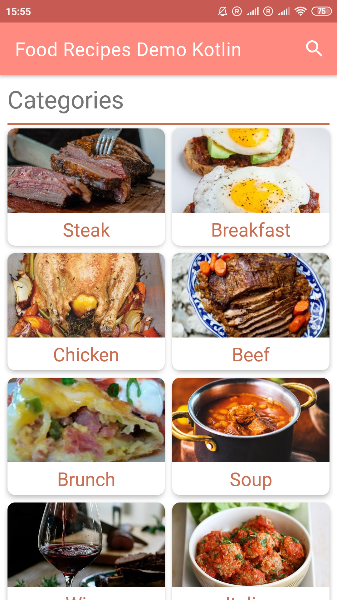
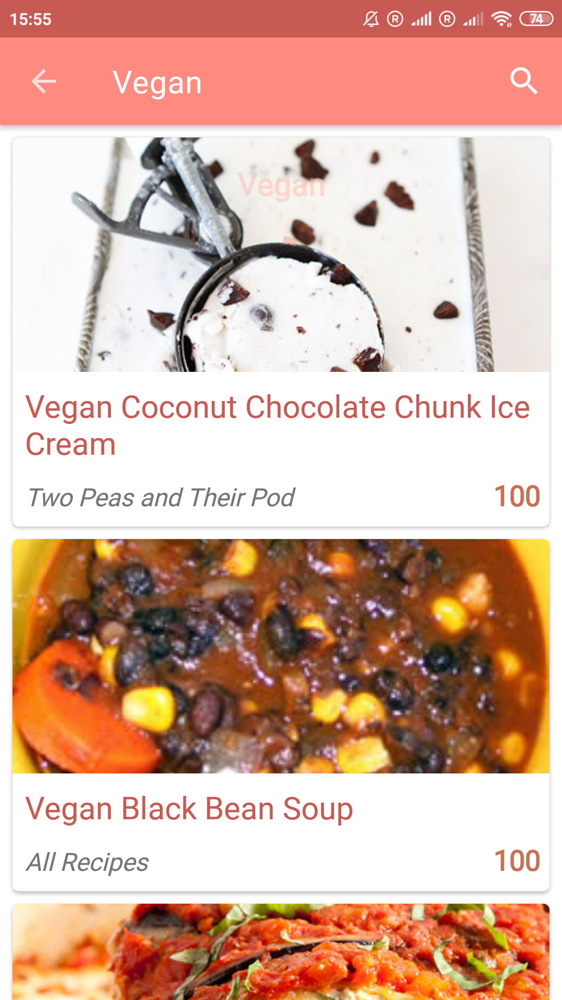
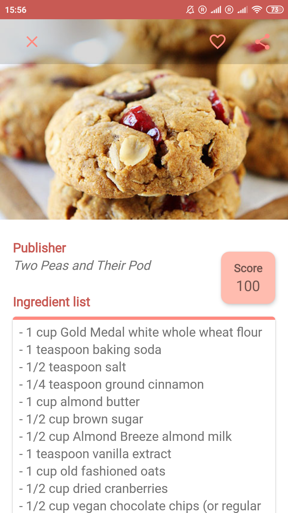

<h1 align="center">Recipes Search Demo</h1>

Demo app for testing RestApi Calls.
A food recipe search app with retrofit, livedata and using android best practices.

The app is currently not being developed.

The UI was developed as far as enough for displaying the results.

# Screenshots

  
# Libraries Used
  
<b>Lifecycles</b>- Create a UI that automatically responds to lifecycle events.

  
<b>LiveData</b> - Build data objects that notify views when the underlying database changes.

  
<b>Room</b> - Caching the network data for offline use.
 
  
<b>ViewModel</b> - Persist the data on configuration changes.

  
<b>Glide</b> - Image Loading.

  
<b>Retrofit</b> - Http Requests.

  
<b>Gson</b> - Convert Json objects.

  
<b>Circle Imageview</b> - Display images in a circle.

  
<b>RecyclerView </b> - Display list and handle clicks.

   
  
# Non-Goals
  
The focus of this project was on HTTP requests and caching the data for offline use using the MVVM pattern.

  
The UI only was worked till the point were we could get and display the results from the requests.

   
  
# App architecture
  
The app was developed taking in account the best practices and recommended architecture from Google for building apps.

  
It uses the repository pattern and the single source of truth. Each component depends only on the component one level below it. For example, activities depend only on a view model. The repository is the only class that depends on multiple other classes.

  

    
  

   
   
   
   
   

### Disclaimer
###### Although the code was written by me, the current app was developed as part of a course on android architecture.

